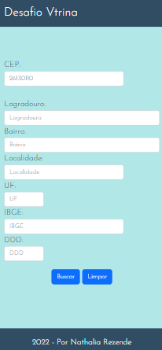

# Desafio Vtrina

O desafio consiste em desenvolver uma aplicação em NodeJS onde através de uma consulta de CEP(ViaCep), receberá as seguintes informações, LOGRADOURO, BAIRRO, LOCALIDADE, UF, IBGE, DDD.

## Layout

Desktop  | Mobile
:---:|:---:
  |  

## Pré-requisitos

```
NodeJS
```

## Instalação

Você pode utilizar o projeto seguindo esses passos:

- Utilize o git clone em uma pasta de sua escolha.
```
$ git clone https://github.com/NathaliaRezendet/Desafio-vtrina.git
```
- Execute o comando a seguir no terminal para instalar as dependências:
```
$ npm i 

ou

$ npm install 
```
Para executar o projeto digite:
```
$ npm run dev
```

## Deploy

Você pode acessar o deploy da aplicação clicando [AQUI!](https://desafio-vtrina.vercel.app/)

## Tecnologias e ferramentas utilizadas


* HTML
* CSS
* BOOTSTRAP
* NODE JS
* VISUAL STUDIO CODE

## Desenvolvedora

- [Nathalia Rezende](https://www.linkedin.com/in/nathaliarezendet/) 


## Licença

 - Este projeto está sob a licença (sua licença) - veja o arquivo [LICENSE.md](./LICENSE) para detalhes.


---
 Por [Nathalia](https://github.com/NathaliaRezendet) 😊